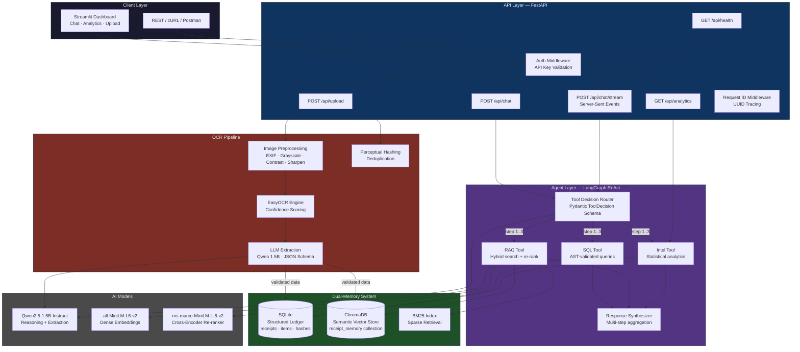
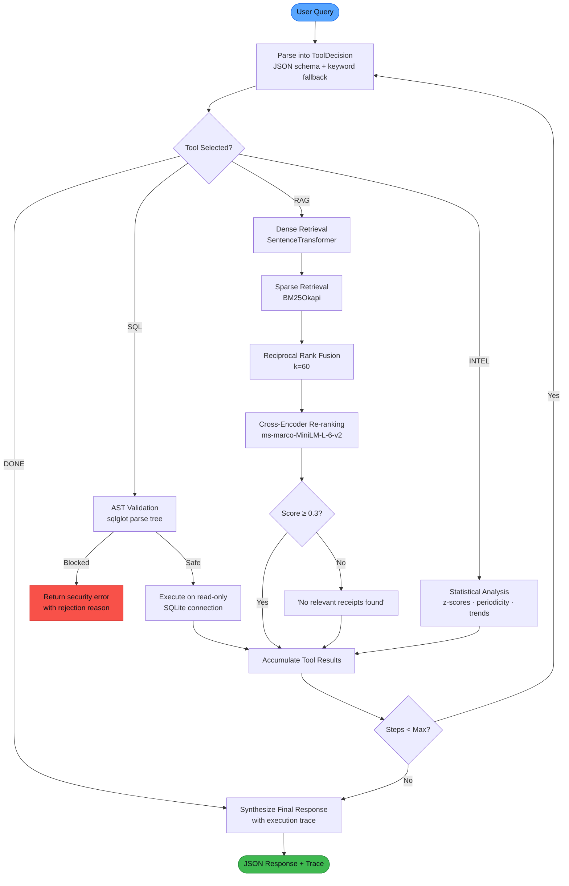
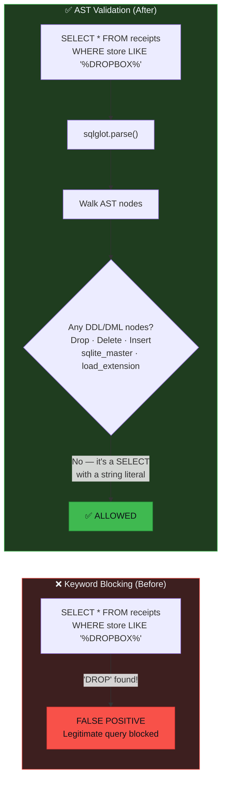

<div align="center">

# 🔒 Vault Copilot

**AI-Powered Financial Intelligence Agent with Dual-Memory Architecture**

[](https://www.python.org/downloads/)
[](#testing)
[](#testing)
[](LICENSE)
[](https://fastapi.tiangolo.com/)
[](docker-compose.yml)

*A multi-step ReAct agent that reasons over financial data using a hybrid retrieval pipeline, AST-validated SQL, and computer-vision-powered receipt ingestion.*

[Features](#-key-features) · [Architecture](#-architecture) · [Quick Start](#-quick-start) · [API Reference](#-api-reference) · [Testing](#-testing) · [Tech Stack](#-tech-stack)

</div>

---

## 🎯 What It Does

Vault Copilot is a **full-stack AI financial assistant** that:

1. **Ingests receipts** via OCR (EasyOCR) with image preprocessing, confidence scoring, and perceptual hash deduplication
2. **Stores data** in a dual-memory system — structured SQL ledger + semantic vector memory
3. **Reasons over your finances** using a multi-step ReAct agent that chains SQL queries, semantic search, and statistical analytics
4. **Answers natural language questions** like *"Do I have any recurring subscriptions?"* or *"What was my most unusual purchase?"*

---

## ✨ Key Features

| Category | Feature | Implementation |
|---|---|---|
| 🤖 **Agent** | Multi-step ReAct reasoning | LangGraph state machine, 1–3 tool calls per query |
| 🤖 **Agent** | Structured tool selection | Pydantic schema with JSON parsing + keyword fallback |
| 🤖 **Agent** | Execution tracing | Per-step logging of tool, reasoning, latency |
| 🔍 **RAG** | Hybrid retrieval | Dense (SentenceTransformer) + Sparse (BM25) + RRF fusion |
| 🔍 **RAG** | Cross-encoder re-ranking | `ms-marco-MiniLM-L-6-v2` re-ranker with relevance threshold |
| 🔍 **RAG** | Quantitative evaluation | 50-query benchmark with recall@k, MRR, precision metrics |
| 🛡️ **Security** | AST-based SQL validation | `sqlglot` structural analysis — not keyword matching |
| 🛡️ **Security** | Read-only query execution | SQLite `?mode=ro` URI for all analytics queries |
| 🛡️ **Security** | API authentication | API key header with middleware enforcement |
| 🧾 **OCR** | Image preprocessing | Auto-orient, grayscale, autocontrast, sharpen (Pillow) |
| 🧾 **OCR** | Confidence scoring | Per-box confidence with threshold-based warnings |
| 🧾 **OCR** | Receipt deduplication | Perceptual hashing (`imagehash.phash`) prevents duplicates |
| 📊 **Analytics** | Anomaly detection | Per-category z-score analysis (σ > 2.0 threshold) |
| 📊 **Analytics** | Subscription detection | Visit periodicity analysis (weekly/monthly classification) |
| 📊 **Analytics** | Spending trends | Weekly/monthly aggregation with direction detection |
| 🏗️ **Infra** | Production API | FastAPI with lifespan, streaming SSE, request tracing |
| 🏗️ **Infra** | Containerized | Multi-stage Dockerfile + Docker Compose |
| 🏗️ **Infra** | Structured logging | Loguru with JSON mode, file rotation, request correlation |

---

## 🏗 Architecture

### System Overview



### Agent Decision Flow



### Receipt Ingestion Pipeline

```mermaid
flowchart LR
    IMG["📷 Receipt Image<br/>JPEG / PNG"] --> VALIDATE["File Validation<br/>MIME + size check"]
    VALIDATE --> PHASH["Perceptual Hash<br/>imagehash.phash()"]
    PHASH --> DEDUP{"Duplicate?"}
    DEDUP -->|Yes| REJECT["⚠️ Duplicate rejected"]
    DEDUP -->|No| PREPROCESS["Image Preprocessing<br/>EXIF → Grayscale →<br/>Autocontrast → Sharpen"]
    PREPROCESS --> OCR["EasyOCR<br/>detail=1 mode"]
    OCR --> CONFIDENCE["Confidence Scoring<br/>avg across all boxes"]
    CONFIDENCE --> TRUNCATE["Truncate text<br/>to 500 chars"]
    TRUNCATE --> LLM["Qwen 1.5B<br/>JSON extraction"]
    LLM --> EXTRACT{"Valid JSON?"}
    EXTRACT -->|Strategy 1-5| PARSE["Pydantic Validation<br/>ReceiptSchema"]
    EXTRACT -->|All fail| FAIL["extraction_failed=true<br/>+ raw OCR text returned"]
    PARSE --> STORE_SQL[("SQLite<br/>receipts + items")]
    PARSE --> STORE_VEC[("ChromaDB<br/>semantic embedding")]
    STORE_SQL & STORE_VEC --> SUCCESS["✅ Receipt vaulted"]

    style IMG fill:#58a6ff,stroke:#1f6feb,color:#0d1117
    style SUCCESS fill:#3fb950,stroke:#238636,color:#0d1117
    style REJECT fill:#f0883e,stroke:#d29922,color:#0d1117
    style FAIL fill:#f85149,stroke:#da3633,color:#0d1117
```



### SQL Safety — AST Validation vs Keyword Blocking



---

## 📁 Project Structure

```
vault-copilot/
├── src/
│   ├── agent/
│   │   ├── graph.py              # Multi-step ReAct agent (LangGraph)
│   │   └── tools.py              # Deterministic financial analytics
│   ├── memory/
│   │   ├── sqlite_db.py          # AST-validated SQL + audit logging
│   │   └── vector_db.py          # Hybrid RAG + cross-encoder re-ranker
│   ├── ocr/
│   │   └── pipeline.py           # Image preprocessing + OCR + LLM extraction
│   ├── api/
│   │   └── main.py               # FastAPI production server
│   ├── ui/
│   │   └── app.py                # Streamlit dashboard
│   ├── config.py                 # Centralized env-var configuration
│   └── logging_config.py         # Structured loguru setup
├── tests/
│   ├── conftest.py               # Shared fixtures (tmp_db, mock_llm, etc.)
│   ├── test_sql_safety.py        # 22 SQL validation tests
│   ├── test_rag.py               # 9 RAG retrieval tests
│   ├── test_ocr_pipeline.py      # 19 OCR pipeline tests
│   ├── test_agent.py             # 12 agent reasoning tests
│   ├── test_api.py               # 12 API integration tests
│   └── test_tools.py             # 18 financial analytics tests
├── eval/
│   ├── rag_benchmark.py          # 50-query evaluation dataset
│   └── run_eval.py               # Recall@k, MRR, precision runner
├── Dockerfile                    # Multi-stage production build
├── docker-compose.yml            # API + UI orchestration
├── requirements.txt
├── pyproject.toml                # Pytest + coverage config
├── .env.example                  # Environment variable template
└── README.md
```

---

## 🚀 Quick Start

### Prerequisites

- Python 3.11+
- 4GB+ RAM (3 AI models loaded into memory)
- GPU optional (auto-detected by PyTorch)

### 1. Clone & Install

```bash
git clone https://github.com/YOUR_USERNAME/vault-copilot.git
cd vault-copilot
python -m venv .venv
source .venv/bin/activate  # Windows: .\.venv\Scripts\Activate.ps1
pip install -r requirements.txt
```

### 2. Configure (Optional)

```bash
cp .env.example .env
# Edit .env to set VAULT_API_KEY, model paths, etc.
```

### 3. Run

**Terminal 1 — API Server:**
```bash
uvicorn src.api.main:app --reload
# Loads 3 AI models (~20s), then: "All models loaded — API ready"
```

**Terminal 2 — Streamlit Dashboard:**
```bash
streamlit run src/ui/app.py
# Opens at http://localhost:8501
```

### 4. Docker (Alternative)

```bash
cp .env.example .env
docker-compose up --build
# API: http://localhost:8000  |  UI: http://localhost:8501
```

---

## 📡 API Reference

| Method | Endpoint | Description | Auth |
|--------|----------|-------------|------|
| `GET` | `/api/health` | Health check + model status | ❌ |
| `POST` | `/api/chat` | Natural language query | ✅ |
| `POST` | `/api/chat/stream` | Streaming chat (SSE) | ✅ |
| `POST` | `/api/upload` | Receipt image upload | ✅ |
| `GET` | `/api/analytics` | Financial analytics dashboard | ✅ |
| `GET` | `/docs` | Interactive Swagger UI | ❌ |

### Example — Chat

```bash
curl -X POST http://localhost:8000/api/chat \
  -H "Content-Type: application/json" \
  -H "X-API-Key: your-key" \
  -d '{"query": "What are my recurring subscriptions?"}'
```

**Response:**
```json
{
  "response": "Based on your receipts, I found 2 recurring subscriptions...",
  "execution_trace": [
    {
      "step_number": 1,
      "tool_selected": "INTEL",
      "reasoning": "User is asking about recurring charges — need subscription analysis",
      "latency_ms": 142
    }
  ],
  "total_latency_ms": 285.3,
  "steps_taken": 1
}
```

### Example — Upload Receipt

```bash
curl -X POST http://localhost:8000/api/upload \
  -H "X-API-Key: your-key" \
  -F "file=@receipt.jpg"
```

---

## 🧪 Testing

```bash
# Full suite (114 tests)
pytest tests/ -v

# With coverage report
pytest tests/ --cov=src --cov-report=term-missing

# Specific module
pytest tests/test_sql_safety.py -v
```

### Test Coverage

| Module | Tests | Coverage | What's Tested |
|--------|-------|----------|---------------|
| `sqlite_db.py` | 22 | 81% | AST validation, blocked DDL/DML, string literals, execution, dedup |
| `pipeline.py` | 19 | 85% | Schema, JSON extraction (5 strategies), preprocessing, hashing |
| `tools.py` | 18 | 87% | Anomalies, subscriptions, trends, categories, query-aware focus |
| `graph.py` | 12 | 40% | ToolDecision schema, parsing fallback, chat output structure |
| `main.py` | 12 | 74% | Health, chat, upload, auth (401), analytics, request ID |
| `vector_db.py` | 9 | 87% | Add/search, SearchResult, empty corpus, metadata filtering |
| `config.py` | — | 100% | Covered transitively by all other tests |
| **Total** | **114** | **74%** | |

> `graph.py` coverage is intentionally lower — the agent loop requires a real LLM, so tests mock at the boundary. The tested paths (parsing, fallback, output structure) are the ones most likely to regress.

### RAG Evaluation

```bash
python -m eval.run_eval
```

Runs 50 queries across 5 categories against 25 synthetic receipts, measuring **recall@k**, **MRR**, and **precision@k** across 4 retrieval strategies:

| Strategy | Recall@3 | Recall@5 | MRR | Precision@3 |
|----------|----------|----------|-----|-------------|
| Vector-only | — | — | — | — |
| BM25-only | — | — | — | — |
| Hybrid (RRF) | — | — | — | — |
| **Hybrid + Re-ranker** | — | — | — | — |

> Run `python -m eval.run_eval` to populate these metrics on your hardware.

---

## 🔧 Configuration

All settings via environment variables (see [`.env.example`](.env.example)):

| Variable | Default | Description |
|----------|---------|-------------|
| `VAULT_API_KEY` | *(empty = auth disabled)* | API authentication key |
| `VAULT_DB_PATH` | `finance.db` | SQLite database path |
| `VAULT_LLM_MODEL` | `Qwen/Qwen2.5-1.5B-Instruct` | HuggingFace model for reasoning |
| `VAULT_EMBEDDING_MODEL` | `all-MiniLM-L6-v2` | Dense embedding model |
| `VAULT_RERANKER_MODEL` | `cross-encoder/ms-marco-MiniLM-L-6-v2` | Cross-encoder re-ranker |
| `VAULT_MAX_AGENT_STEPS` | `3` | Max tool calls per query |
| `VAULT_RAG_TOP_K` | `5` | Results per retrieval |
| `VAULT_RELEVANCE_THRESHOLD` | `0.3` | Cross-encoder score cutoff |
| `VAULT_SQL_MAX_ROWS` | `1000` | Row limit for SQL queries |
| `VAULT_OCR_CONFIDENCE_THRESHOLD` | `0.4` | OCR confidence warning threshold |
| `VAULT_LOG_LEVEL` | `INFO` | Logging verbosity |
| `VAULT_LOG_JSON` | `false` | JSON-formatted logs for production |

---

## 🛡️ Security Design

| Layer | Mechanism | Details |
|-------|-----------|---------|
| **SQL Injection** | AST validation via `sqlglot` | Parses query into syntax tree; structurally rejects DDL/DML nodes, `sqlite_master`, `load_extension`, `UNION` |
| **Query Isolation** | Read-only connections | All analytics use `sqlite3.connect("file:path?mode=ro", uri=True)` |
| **Row Exfiltration** | Automatic LIMIT | Queries without LIMIT get `LIMIT 1000` injected via AST |
| **API Auth** | Key-based middleware | `X-API-Key` header validated before protected endpoints |
| **File Upload** | MIME + size validation | Only JPEG/PNG, max 10MB, content-type verified |
| **Duplicate Prevention** | Perceptual hashing | `imagehash.phash()` blocks re-upload of same receipt |
| **Audit Trail** | Query logging | Every SQL execution logged with query text, latency, row count |

---

## 🧰 Tech Stack

| Layer | Technology | Why |
|-------|-----------|-----|
| **LLM** | Qwen2.5-1.5B-Instruct | Small enough for CPU, instruction-tuned for JSON extraction |
| **Embeddings** | all-MiniLM-L6-v2 | Fast, high-quality 384d dense vectors |
| **Re-ranker** | ms-marco-MiniLM-L-6-v2 | Cross-encoder for precision re-ranking after fusion |
| **Sparse Retrieval** | BM25Okapi (rank_bm25) | TF-IDF-based keyword matching for exact term recall |
| **Vector Store** | ChromaDB | Embedded, persistent, zero-config vector database |
| **SQL Validation** | sqlglot | Production SQL parser — structural AST analysis |
| **OCR** | EasyOCR | Multi-language, GPU-optional text detection |
| **Image Processing** | Pillow | EXIF handling, grayscale, contrast, sharpen pipeline |
| **Deduplication** | imagehash | Perceptual hashing resistant to resize/compression |
| **Agent Framework** | LangGraph | State machine for multi-step ReAct loops |
| **API** | FastAPI | Async, auto-docs, Pydantic validation, SSE streaming |
| **UI** | Streamlit | Rapid prototyping with execution trace visualization |
| **Logging** | Loguru | Structured logging with JSON mode and file rotation |
| **Testing** | Pytest | 114 tests, 74% coverage, isolated fixtures |
| **Containers** | Docker + Compose | Multi-stage build, non-root user, health checks |

---

## 📈 Design Decisions

### Why AST validation over keyword blocking?

Keyword blocking (`if "DROP" in query.upper()`) blocks legitimate queries like `WHERE store LIKE '%DROPBOX%'` while failing to catch `DR/**/OP TABLE`. AST validation parses the actual syntax tree — it knows the difference between a `DROP` node and a string literal containing "DROP".

### Why hybrid retrieval + cross-encoder?

Dense vectors excel at semantic similarity (*"where did I buy coffee?"* → Starbucks) but miss exact terms. BM25 catches exact matches but misses paraphrases. RRF fusion combines both, and the cross-encoder re-ranker provides a second opinion that dramatically improves precision on borderline results.

### Why a multi-step agent?

Single-tool routing can't handle *"Compare my grocery spending to last month and flag anything unusual"* — that requires SQL (historical data), INTEL (anomaly detection), and synthesis. The ReAct loop chains up to 3 tools per query with explicit reasoning traces.

### Why perceptual hashing for dedup?

Exact file hashing (SHA-256) fails when the same receipt is photographed twice at different angles or with different compression. Perceptual hashing (`phash`) produces similar hashes for visually similar images, catching real-world duplicates.

---

## 🤝 Contributing

1. Fork the repository
2. Create a feature branch (`git checkout -b feature/amazing-feature`)
3. Run tests (`pytest tests/ -v`)
4. Commit changes (`git commit -m 'Add amazing feature'`)
5. Push to branch (`git push origin feature/amazing-feature`)
6. Open a Pull Request

---

## 📄 License

This project is licensed under the MIT License — see the [LICENSE](LICENSE) file for details.

---

<div align="center">

**Built with** 🤖 LangGraph · 🔍 ChromaDB · 🛡️ sqlglot · 🧾 EasyOCR · ⚡ FastAPI

</div>
